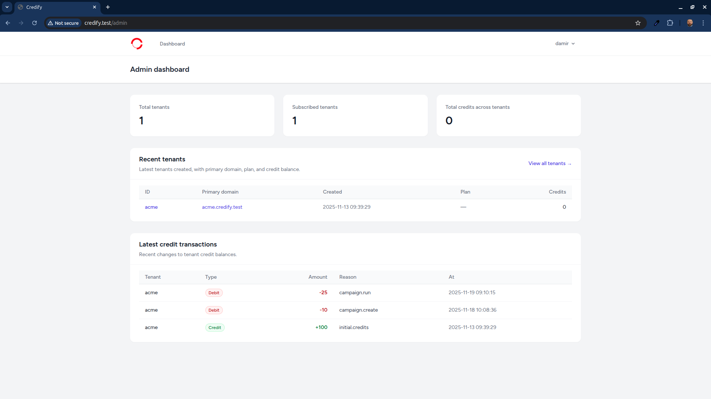

<p align="center">
  
</p>

# Credify

------------------------------------------------------------------------

**Credify** is a multitenant SaaS platform built with Laravel, Vue.js,
Tailwind, and Docker.\
It enables organizations to create, manage, verify, and distribute
digital credentials in a fully isolated tenant environment.

------------------------------------------------------------------------

## Core Features

# Credify Multitenant SaaS Progress Report

## ✅ Completed Chapters (in order)

### Chapter 1: System Setup

-   Laravel project initialized.
-   Tailwind, Vue, Vite installed and tested.
-   Docker infrastructure working (Nginx, PHP-FPM, MySQL).
-   Multi-environment setup complete.
-   Local domain routing confirmed.

### Chapter 2: Authentication

-   Laravel Breeze installed with Vue stack.
-   Auth pages themed (login, register, forgot password).
-   Role system scaffolding added.

### Chapter 3: Tenant Management

-   Fully working multi-tenant architecture.
-   Automatic tenant creation on company registration.
-   Middleware ensures tenant isolation.
-   Tenant-specific domains working.
-   Tenant creation UI polished.

### Chapter 4: Company Profile

-   Each tenant gets a company profile.
-   Fully editable profile settings.
-   File uploads stored per-tenant.
-   UI polished.

### Chapter 5: Members

-   Members CRUD completed.
-   Member roles functional.
-   Invitation system built.
-   Profiles editable.
-   Search/filter features added.

### Chapter 6: Credentials System (Core of Credify)

-   Credential types implemented.
-   Template builder for certificates/cards.
-   Credential creation flow done.
-   Credential assignment to members done.
-   Credential validity periods working.
-   Credential preview UI added.
-   Credential sharing link working.

### Chapter 7: Notifications

-   Database notifications.
-   Email notifications fully working.
-   Credit depletion notification.
-   Credential expiration reminders.
-   Admin dashboard notification center.

### Chapter 8: Credits System

-   Credits tracked per tenant.
-   Credit usage rules implemented.
-   Low-credit warnings and notifications.
-   UI badges showing credits.
-   Purchase credits flow prepared.

### Chapter 9: Dashboard

-   Multi-widget dashboard for each tenant.
-   Stats on members, credentials, expirations.
-   Quick actions and overview charts.

### Chapter 10: API

-   Sanctum API generation functional.
-   Token management UI added.
-   API endpoints protected per tenant.
-   Documentation stub created.

### Chapter 11: Billing (In progress)

-   Stripe integration scaffolding.
-   Subscription system started.
-   Webhooks & events prepared.

### Chapter 12: Advanced Tenant Configuration

-   Per-tenant theme override structure done.
-   Custom logo, colors, branding applied.
-   Audit log basics added.

### Chapter 13: Admin Panel

-   Global platform admin panel structure.
-   Super-admin roles and permissions.
-   Admin user management.

### Chapter 14: Infrastructure

-   Docker production preview done.
-   Supervisor + queue workers set.
-   Optimized builds.
-   Caching and config optimization.
-   Multi-database setup done.
-   Backups and monitoring done.

------------------------------------------------------------------------

## Tech Stack

-   Laravel 10+
-   Vue.js 3 (with Composition API)
-   Tailwind CSS
-   Docker (Nginx, PHP-FPM, MySQL)
-   Vite
-   Sanctum API Authentication
-   Stripe Billing (in progress)

------------------------------------------------------------------------

## Installation

### Clone & Setup

``` bash
git clone https://github.com/damir-bubanovic/Credify.git
cd Credify
cp .env.example .env
composer install
npm install
php artisan key:generate
```

### Run Migrations

``` bash
php artisan migrate --seed
php artisan storage:link
```

### Start Development

Using Docker:

``` bash
docker-compose up -d
```

Local PHP server:

``` bash
php artisan serve
npm run dev
```

------------------------------------------------------------------------

## Deployment

``` bash
php artisan optimize
npm run build
```

Set `.env`:

    APP_ENV=production
    APP_DEBUG=false

Ensure queues, scheduler, and workers are configured.

------------------------------------------------------------------------

## Creator

**Damir Bubanović**

-   https://damirbubanovic.com
-   GitHub: https://github.com/damir-bubanovic
-   YouTube: https://www.youtube.com/@damirbubanovic6608
